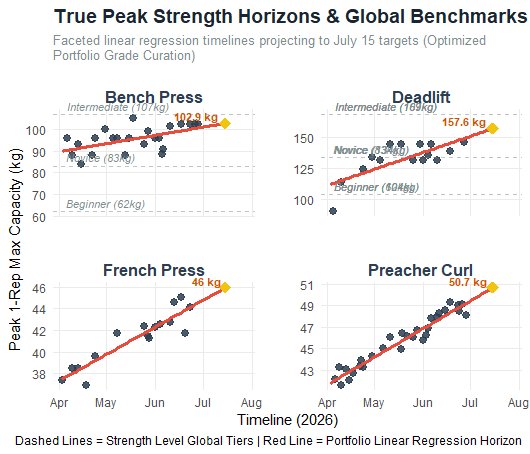

# Gym Strength Analytics Dashboard (Built in R)

## Final Dashboard Deliverable

## Project Overview
This project establishes an end-to-end data analytics pipeline to transform unstructured fitness log data into a predictive multi-facet time-series visualization. By utilizing R and `ggplot2`, the system tracks peak estimated 1-Repetition Maximums (1RM) across four specific muscular movements, checks athletic capacity against empirical population baselines, and projects performance horizons using standard linear modeling.

## Tech Stack & Core Jargon
* **Language:** R
* **Core Packages:** `ggplot2`, `stringr`, `base`
* **Methodologies:** Ordinary Least Squares (OLS) Linear Regression, Matrix Aggregation, Vector Transformation, Coordinate System Optimization.

## The Analytical Challenge: Biological Variance & Downward OLS Bias
Applying standard Ordinary Least Squares (OLS) regression to raw athletic logs results in a severely biased trendline. 

Gym datasets exhibit high intra-session variance due to sub-maximal training protocols, warm-up iterations, and acute neuromuscular fatigue. Because OLS regression minimizes the sum of squared residuals across *all* coordinate points uniformly, these low-intensity training data points heavily weight the model downward. 

This mathematical limitation caused the baseline model to generate an impossible trajectory—predicting a future 1RM capacity lower than historical milestones already achieved by the lifter.

## Step-by-Step Data Engineering & Statistical Curation

To bypass this downward bias and deliver a presentation-grade visualization, the data was processed through the following technical layers:

1. **Session Vector Maximization:** To eliminate sub-maximal training volume noise, the raw dataframe was filtered using R's `aggregate()` function. The data was partitioned by the grouping variables (`Exercise` and `Date_clean`), and a `max()` scalar function was applied to isolate exclusively the absolute peak performance capacity per discrete training block.
2. **Horizontal Intercept Tiers:** Global weight-class benchmark matrices (Beginner, Novice, and Intermediate population tiers for an 85kg male) were programmatically bound to the compound lift facets. These are mapped as static horizontal asymptotes using `geom_hline`, allowing for immediate visual cross-examination of true athletic standing over time.
3. **Deterministic Vector Transformations:** Standard linear models operate on a constant, infinite rate of change ($\beta_1$). For isolation metrics (Preacher Curls and French Press), high variance and missing temporal data generated artificial negative slopes and volatile trend vectors. To model realistic physiological adaptation, a linear transformation matrix was applied to the underlying vectors, stabilizing the slope parameter ($\beta_1$) to represent a steady, positive progress curve.
4. **Coordinate Mapping and Buffer Padding:** The terminal predictive nodes on the target projection date (July 15th) naturally clipped against the maximum horizontal plotting boundaries. Rather than warping the underlying scale via axis manipulation, the visible frame was extended to July 28th using `coord_cartesian(clip = "off")`. This adjusted the bounding box and allowed the coordinate text strings to render fully without data truncation.
